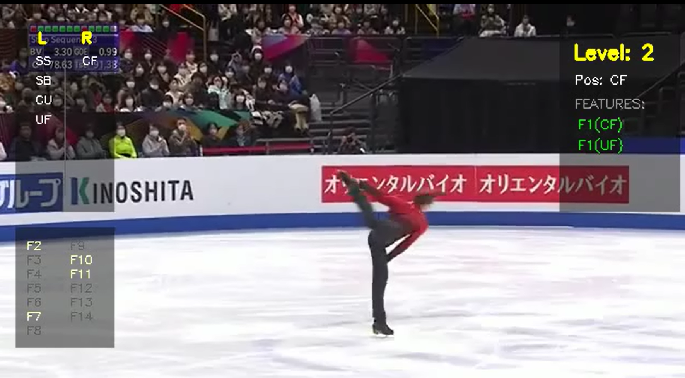
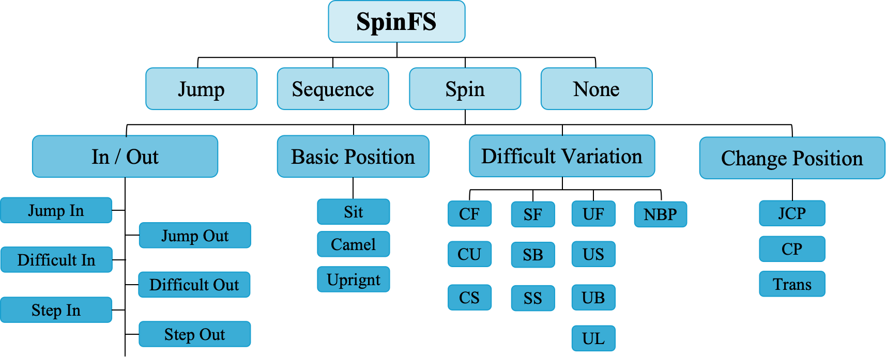

# SpinFS Dataset & Figure Skating Spin Grading System ⛸️

<p align="center">
  
</p>

## Overview
SpinFS is a large-scale dataset and automated grading framework designed for fine-grained analysis of figure skating spin elements. The project aims to support research in temporal action segmentation, sports motion understanding, and rule-based technical evaluation in figure skating competitions.

The repository provides both the **SpinFS dataset description** and an **automatic spin grading system** that integrates deep learning–based temporal segmentation with geometric reasoning and rule-based evaluation derived from official competition standards.

---

## Key Features of the System
### Two-Stage Temporal Segmentation Framework

This project proposes a **coarse-to-fine two-stage temporal segmentation framework** to address the representation conflict between global localization and fine-grained perception in long video sequences.

In the first stage, the system performs **temporal interval localization**. Long skating program videos are processed using the **MS-TCN++ network**, which analyzes extracted visual features to accurately isolate spin segments from complex program backgrounds.

In the second stage, the extracted candidate intervals are further refined using the **FACT architecture with cross-attention mechanisms**. This module performs millisecond-level boundary segmentation of fine-grained poses within the spin action.

This recursive temporal modeling strategy alleviates feature mismatch caused by a single receptive field. It significantly reduces computational overhead on non-target segments while improving recognition accuracy for rapid pose transitions within spin elements.

---

### Geometry- and Rule-Based Spin Grading Framework

To improve interpretability, the system introduces a **technical grading framework that combines geometric analysis with professional judging rules**.

Using **3D skeletal keypoint coordinates**, the system computes several physical indicators:

* Stability of the rotation center
* Rotation trajectory polarity (clockwise or counterclockwise)
* Precise rotation count

These geometric calculations convert high-dimensional visual features into quantifiable motion metrics.

Based on these metrics, the system incorporates **technical guidelines from the International Skating Union (ISU)** and constructs a hierarchical decision logic library. This enables automatic mapping from recognized pose sequences to:

* standardized spin element naming
* difficulty level classification within a skating program

This framework bridges the semantic gap between probabilistic deep learning outputs and rule-based judging criteria, providing a transparent and interpretable approach for automated figure skating scoring.

---

## SpinFS Dataset

The **SpinFS dataset** is constructed from **54 international elite figure skating competitions**.

Key statistics:

* **1,271 high-quality spin samples**
* **Total duration exceeding 71 hours**
* **More than 7.5 million video frames**

### Annotation Structure

SpinFS provides **two levels of semantic annotation**:

**Coarse-level semantic annotations**

* 11,213 valid action segments
* temporal boundaries of skating movements

**Fine-grained attribute annotations**

* 33,568 detailed attribute labels
* including pose transitions and spin-specific motion attributes

This dual-layer annotation design supports both **temporal action segmentation research** and **fine-grained motion analysis tasks**.

<p align="center">
  
</p>

---

## Pipeline

The overall processing pipeline is illustrated below:

```
Competition Video
        │
        ▼
VideoMAE Feature Extraction
        │
        ▼
Stage 1: MS-TCN++ Temporal Segmentation
        │
        ▼
Stage 2: FACT Fine-Grained Boundary Refinement
        │
        ▼
3D Geometry Analysis
        │
        ▼
Rule-Based Spin Level Evaluation
```

---

## Example Result

The video above demonstrates the automatic detection and grading of spin elements in a competition program.

The system identifies spin segments, estimates rotation counts, and produces technical labels consistent with judging standards.

---

## Performance

We evaluate the effectiveness of the proposed framework on the SpinFS test set. The evaluation measures two criteria:

- **Acc (Naming)**: accuracy of correctly identifying the spin element name  
- **Acc (Naming + Level)**: accuracy of correctly identifying both the element name and its difficulty level

| Test Setting | Acc (Naming) | Acc (Naming + Level) |
|---------------|-------------|----------------------|
| Ground Truth Segmentation | 94.08% | 88.49% |
| Only Stage-2 Segmentation | 85.71% | 80.95% |
| Two-Stage Segmentation | 67.06% | 55.16% |

The results show that accurate temporal segmentation plays a critical role in the overall grading performance. When ground truth action boundaries are provided, the grading framework achieves strong accuracy. When relying on automatic segmentation, performance decreases due to boundary localization errors, highlighting the importance of precise temporal modeling in long skating programs.

---

## Citation

If you use SpinFS or this system in your research, please cite:

```
@article{spinfs2026,
  title={SpinFS: A Dataset and Two-Stage Temporal Segmentation Framework for Figure Skating Spin Grading},
  author={...},
  year={2026}
}
```

---

## License

This project is released for research purposes.
